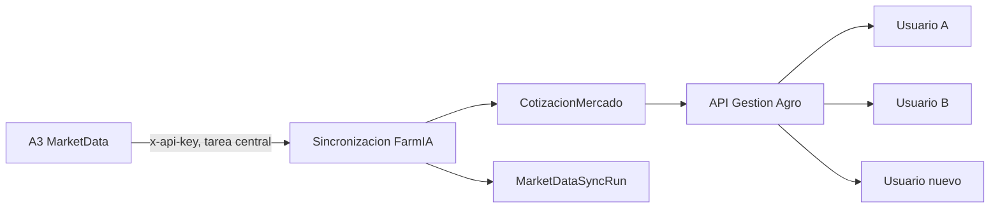

# A3 MarketData en FarmIA

Estado documentado: 3 de agosto de 2026.

Este documento privado explica la integracion desarrollada en la rama
`tincho/gestion-agro-a3-valuacion`, como queda compartida entre usuarios y que
falta antes de habilitarla en produccion. No contiene credenciales. Las claves
UAT y produccion nunca deben guardarse en este repositorio, en `farmia_app`, en
un worktree ni en capturas o logs.

## Estado actual

La implementacion esta desarrollada y validada localmente, pero todavia no es
una funcionalidad productiva. Al momento de escribir esta guia, los cambios de
la rama siguen sin commit ni push.

En la prueba local quedaron disponibles 1901 cotizaciones historicas A3, con
ultima fecha de mercado 2026-07-31. Se migraron las 1901 copias A3 que antes
estaban asociadas a un perfil a una unica tabla compartida y se eliminaron las
copias por perfil. El archivo historico aporto datos para Soja, Maiz y Trigo;
no contenia historia de Girasol ni Sorgo.

La llamada en vivo a UAT autentico correctamente, pero devolvio cero contratos
agricolas actuales. Esto prueba conectividad y autenticacion, no prueba que la
fuente productiva vaya a devolver instrumentos. La clave de produccion y el
alcance comercial de la licencia deben validarse antes del go-live.

## Que hace la integracion

A3 funciona como una fuente central de referencia para futuros agricolas en
USD por tonelada. No es informacion propiedad de un usuario o establecimiento.
Una cotizacion se almacena una sola vez y puede ser consultada por todos los
usuarios de FarmIA.



Consecuencias de este diseno:

- un usuario nuevo ve inmediatamente la historia compartida que ya exista;
- ningun usuario debe cargar o actualizar A3 por su cuenta;
- si falta la clave, deja de actualizarse la fuente, pero la historia guardada
  sigue visible;
- si A3 devuelve cero filas, la ejecucion queda auditada y no borra la historia
  anterior;
- las sincronizaciones manuales y la importacion de XLSX quedan reservadas a
  administradores como operaciones excepcionales;
- la cotizacion global se relaciona en lectura con el `CultivoMaestro` de cada
  perfil mediante nombre o codigo normalizado;
- si no existe una coincidencia local, la cotizacion sigue visible sin crear un
  cultivo automaticamente.

A3 no modifica stock fisico, Caja, margen, contratos comerciales, movimientos
de granos ni cotizaciones manuales/BCR. Tampoco convierte hoy el precio de
USD/TN a ARS/TN ni aplica flete, acondicionamiento o gastos comerciales.

## Componentes implementados

### Persistencia

- `CotizacionMercado`: guarda la referencia compartida sin `userId` ni
  `workspaceId`. La unicidad es proveedor + fecha de mercado + referencia del
  contrato.
- `MarketDataSyncRun`: audita origen, estado, horarios, filas recibidas,
  creadas, actualizadas y omitidas, y el error acotado si falla.
- `CotizacionGrano`: conserva el comportamiento por perfil para carga manual y
  BCR; ya no debe contener datos A3.

La migracion Prisma esta en
`api/prisma/migrations/20260803120000_a3_marketdata_futures/`.

### Backend

`api/src/gestion-agro/a3-market-data.service.ts` centraliza:

- estado de configuracion y disponibilidad de datos;
- lectura de cotizaciones comunes con mapeo al cultivo de cada perfil;
- sincronizacion con A3;
- importacion del historico XLSX;
- migracion de registros A3 antiguos asociados a perfiles.

Rutas relevantes:

- `GET gestion-agro/cotizaciones-grano/a3/configuracion`: informa si hay clave,
  si existen datos, cantidad, ultima fecha de mercado y ultima ejecucion;
- `POST gestion-agro/cotizaciones-grano/a3/sync`: sincronizacion excepcional,
  solo administradores;
- `POST gestion-agro/cotizaciones-grano/a3/historico`: importacion XLSX, solo
  administradores.

El proceso programado usa
`api/src/cli/a3-marketdata-sync.ts`. Primero absorbe cualquier dato A3 legado y
despues consulta al proveedor.

### Interfaz

La solapa **Mercado A3** muestra tarjetas por grano, contratos disponibles,
seleccion de contrato, grafico historico y tabla. Tambien identifica cultivos
de FarmIA sin mercado A3 conocido.

La solapa **Cotizaciones e historial** consume las mismas cotizaciones
compartidas. El estado distingue dos conceptos:

- **configurado**: el backend tiene una clave para ejecutar nuevas consultas;
- **datos disponibles**: la base ya contiene cotizaciones compartidas.

Por eso es posible que existan datos aunque la clave no este configurada en el
proceso que se esta ejecutando. La pantalla prioriza la disponibilidad real de
datos y no pide a cada usuario que configure A3.

## Configuracion local

Los valores reales se guardan solo en archivos ignorados por Git:

- `.env` en la raiz del worktree: clave y URL de A3;
- `api/.env`: base de datos, puertos y otras variables propias de ese worktree.

Ejemplo sin credenciales:

```dotenv
A3_MARKETDATA_BASE_URL=https://apiuat.mae.com.ar/MarketData/v1/
A3_MARKETDATA_API_KEY=<CLAVE_UAT_LOCAL>
A3_MARKETDATA_MAX_CONTRACTS_PER_GRAIN=3
```

La API carga primero sus valores locales de `api/.env` y luego completa lo que
falte desde el `.env` de la raiz. La clave nunca se envia al frontend: el
backend agrega el encabezado `x-api-key` al consultar A3.

En la validacion de esta rama, Postgres y el worker funcionaron en Docker y la
API se ejecuto como proceso local en el puerto 3201. La reconstruccion de la
imagen Docker de la API quedo bloqueada por un timeout de red contra el
registro npm; no fue un error demostrado del codigo A3.

## Como funcionara en produccion

### Secretos y ambientes

Cada GitHub Environment debe definir el secreto `A3_MARKETDATA_API_KEY`:

| Ambiente | Credencial | URL predeterminada |
| --- | --- | --- |
| `staging` | clave UAT | `https://apiuat.mae.com.ar/MarketData/v1/` |
| `production` | clave de produccion | `https://api.mae.com.ar/MarketData/v1/` |

Terraform recibe la variable sensible `a3_marketdata_api_key`, crea un
`SecureString` en AWS Systems Manager Parameter Store y lo inyecta solamente
en el contenedor API de ECS. El scheduler no se crea si la variable esta
vacia.

### Actualizacion central

EventBridge Scheduler ejecuta una tarea ECS de lunes a viernes a las 21:30 de
Argentina (`cron(30 21 ? * MON-FRI *)`). La tarea corre:

```text
node dist/src/cli/a3-marketdata-sync.js
```

Cada ejecucion tiene hasta dos reintentos de infraestructura y deja su
resultado en `MarketDataSyncRun`. Todos los usuarios leen despues los mismos
registros de `CotizacionMercado`; no se ejecuta una consulta por usuario ni al
abrir la pantalla.

Los feriados del mercado no estan modelados: el scheduler igual se ejecutara
en un feriado de lunes a viernes. Una respuesta vacia no debe considerarse por
si sola un incidente ni eliminar datos, pero debe observarse junto con la
ultima fecha de mercado.

## Requisitos antes del go-live

### Bloqueantes

1. Confirmar con A3 que la licencia habilita futuros agricolas en produccion y
   permite almacenar historia y mostrarla a todos los usuarios de FarmIA.
2. Por haber circulado las claves por correo y chat, evaluar con A3 su rotacion
   antes del go-live. No asumir que una clave expuesta en esos canales cumple
   la politica de secretos de produccion.
3. Cargar claves diferentes en los GitHub Environments `staging` y
   `production`; no copiar valores en archivos versionados ni variables del
   frontend.
4. Integrar la rama siguiendo el flujo de Gestion Agro, desplegar primero en
   staging y aplicar la migracion Prisma.
5. Verificar en staging que existe el scheduler, que la tarea ECS tiene salida
   a la API de A3 y que el secreto no aparece en logs.
6. Validar la clave productiva contra la URL productiva y comprobar que devuelve
   contratos agricolas. El resultado vacio de UAT no alcanza como evidencia.
7. Ejecutar un smoke test productivo: estado de configuracion, conteo, ultima
   fecha de mercado, ultima corrida y visualizacion desde dos perfiles.

### Operacion y monitoreo pendientes

- definir alertas si la ultima corrida falla;
- definir cuantos dias habiles sin avance de `latestMarketDate` se toleran;
- alertar si una fuente que venia devolviendo contratos pasa a cero o cae
  abruptamente en cantidad;
- decidir retencion del historico; actualmente no tiene vencimiento automatico;
- definir si los 1901 o mas registros deben paginarse o virtualizarse en la
  tabla para evitar una pantalla pesada;
- documentar feriados y horarios efectivos de cierre de A3;
- agregar smoke checks de A3 al runbook de staging y produccion;
- decidir si hace falta una vista interna de operaciones para ver corridas y
  reintentar, manteniendo la experiencia del usuario final en modo lectura.

### Evolucion funcional pendiente

- mantener una lista explicita de alias de instrumentos y granos si A3 agrega
  nuevos contratos;
- no crear `CultivoMaestro` automaticamente por datos externos;
- decidir como valorizar cultivos sin futuros A3, por ejemplo Girasol o Sorgo,
  mediante otra fuente o carga manual;
- definir una fuente de tipo de cambio y reglas comerciales antes de convertir
  USD/TN a ARS/TN o usar A3 como valuacion neta;
- mantener separadas la referencia futura A3 y la pizarra fisica BCR.

## Runbook resumido

### Si la sincronizacion falla

1. Consultar el estado A3 y la ultima fila de `MarketDataSyncRun`.
2. Revisar logs de la tarea ECS sin imprimir variables de entorno.
3. Comprobar URL, conectividad, vigencia de la clave y respuesta de A3.
4. Confirmar que la historia anterior sigue visible.
5. Corregida la causa, ejecutar la sincronizacion administrativa o esperar la
   siguiente tarea programada.

### Para rotar una clave

1. Actualizar `A3_MARKETDATA_API_KEY` en el GitHub Environment correcto.
2. Ejecutar el deploy/Terraform para actualizar Parameter Store y la revision
   de tarea ECS.
3. Ejecutar una sincronizacion y verificar una corrida exitosa.
4. Recién entonces revocar la clave anterior.

### Si A3 devuelve cero contratos

1. Confirmar que la respuesta fue autenticada y sin error HTTP.
2. Comparar ambiente, fecha, horario y calendario de mercado.
3. No borrar ni reemplazar el historico existente.
4. Si persiste en produccion, consultar a A3 por el alcance de instrumentos de
   la clave y del endpoint.

## Evidencia de validacion local

En la rama se verifico:

- 145 suites de API aprobadas, 2485 tests aprobados y 2 omitidos;
- chequeo completo de TypeScript;
- builds de API y frontend;
- validacion de Prisma y guard de despliegue;
- `terraform fmt` y `terraform validate`;
- E2E enfocado en Mercado A3;
- revision visual de datos compartidos, ausencia de acciones A3 por usuario y
  disponibilidad del historico.

Esta evidencia demuestra el comportamiento local de la rama. No reemplaza las
pruebas de licencia, red, secreto, datos reales y scheduler en staging y
produccion.

## Referencias de codigo

- `api/src/gestion-agro/a3-market-data.service.ts`
- `api/src/gestion-agro/market-price.providers.ts`
- `api/src/cli/a3-marketdata-sync.ts`
- `api/prisma/schema.prisma`
- `frontend/src/components/flujos/gestion-agro/A3MarketDashboard.tsx`
- `frontend/src/pages/flujos/ValorizacionesGestionPage.tsx`
- `infra/app/compute.tf`
- `infra/app/database.tf`
- `infra/app/variables.tf`
- `.github/workflows/deploy-staging.yml`
- `.github/workflows/deploy-production.yml`
- `docs/ARCHITECTURE.md`
